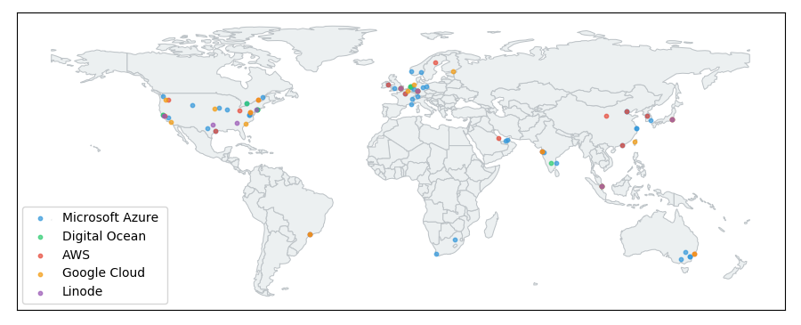

# Geographic Locations of Data Centers 

This notebook provides a visualization of the geographic locations of the data centers for various cloud providers to give a sense of the geographic coverage of cloud computing. The dataset can be found in the `fixtures` directory, and contains general locations for the following providers:

- Amazon Web Services
- Google Cloud Compute 
- Microsoft Azure 
- Digital Ocean 
- Linode 

The notebook has interactive controls for filtering and zooming to more easily view the data center locations.
